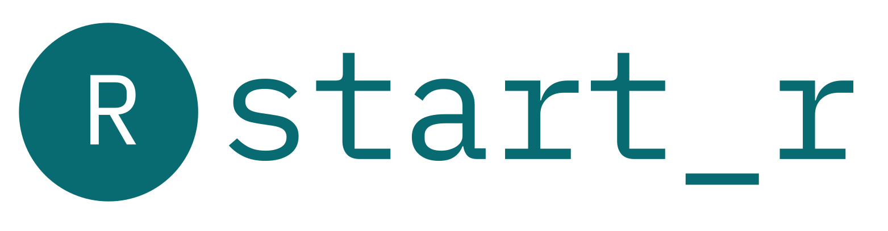
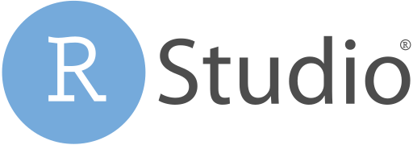
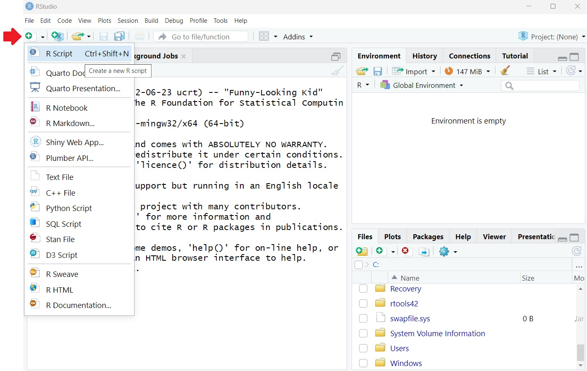

# Welcome to StartR

```{r fig, fig.cap=" ",  out.width="50%", fig.align="center", echo=FALSE}

```

StartR is a short course for someone who wants a beginner's guide to using R and RStudio. This resource is suitable for anyone who wants a gentle self-paced introduction.

```{r fig1, fig.cap="**R** is not just the sound a pirate makes, but it is also a programming language.", out.width="25%", fig.align="center", echo=FALSE}

```

## What is R and RStudio?

R is a programming language for statistical computing and data visualisation (see <https://www.r-project.org/about.html>). As with any language, you could write a set of instructions or operations for someone to follow.

For example, I could ask you to:

```{r, eval=FALSE}
`stand up` and then,
`walk towards the window` and then,
`return to your seat`
```

I hope you enjoyed looking out of the window for a moment there. We will come back to this later, but the basic logic behind code is writing a series of instructions.

When using R, you'll be giving instructions to our computer to follow and complete.

R is not the same thing as RStudio. RStudio is an integrated development environment (IDE). It provides a user-friendly interface for you to add your instructions and to view output.

Think of the difference between R and RStudio in the same way you would a car dashboard and an engine. The engine of the car works in the background and unless you're a mechanic, it will just work away in the background without much notice. Being seated in the car with the dashboard on the other hand is where you direct or drive your car. RStudio is how you will drive whilst R (the coding language under the hood) is the engine underneath. This book will show you how to drive and to understand how the engine works, but it is really not necessary to become a mechanic, just a good driver!

## Installing R and RStudio

With installation you will need both the car dashboard **and** the engine. You should install two things:

-   R (the engine)
-   RStudio (the car dashboard)

You can install both of these <a href="https://posit.co/download/rstudio-desktop/" target="_blank">here</a>.

## Opening RStudio

Once you have installed both of these, you should only open **RStudio**.

Find RStudio on your computer and open it. The RStudio logo is shown in Figure \@ref(fig:fig2). A frequent mistake is opening the engine `R`, but you should only use RStudio.

```{r fig2, fig.cap="Look out for the RStudio logo.", out.width="25%", fig.align="center", echo=FALSE}

```

When you open RStudio it should look like the screenshot in Figure \@ref(fig:fig3). Notice that there are three main panels.

```{r fig3, fig.cap="RStudio when first opened.", out.width="100%", fig.align="center", echo=FALSE}
knitr::include_graphics("images/rstudio1.jpg")
```

Before you really dive in to getting RStudio to work, you will need to open a new script. To do this, look for the top left button which looks like a blank white page with a green/white `plus` symbol, just like in Figure \@ref(fig:fig4) below.

```{r fig4, fig.cap="Open a new R Script.", out.width="100%", fig.align="center", echo=FALSE}

```

Once you open the new script you should now see four panels just like Figure \@ref(fig:fig5).

```{r fig5, fig.cap="You should see four panels now which means you are ready to start working with RStudio.", out.width="100%", fig.align="center", echo=FALSE}
knitr::include_graphics("images/rstudio2.jpg")
```

Another way to open a new script is to use the menu at the top of the RStudio window: `File > New File > R Script`.

## A Quick Tour of RStudio

Now it is time to learn about the four panels. Let's go through each one by one. These four panels are shown in Figure \@ref(fig:fig6) with a description of each below.

```{r fig6, fig.cap="The four panels in RStudio.", out.width="100%", fig.align="center", fig.pos='H', echo=FALSE}
knitr::include_graphics("images/rstudio3.jpg")
```

**Script Panel**

This is the top left panel. This is an editable space where you will be able to type and edit any code you use. The good news is you can save an R script so you can use it again in the future.

Think of it as an input panel.

**Console Panel**

The bottom left panel is the console. Whilst you can technically type in any code here, I'd advise you not to as you wont be able to save any code. The console is where you can view any output messages. Essentially, once you type in and run your code in the script, RStudio will respond to you via this console panel.

Think of it as an output panel.

**Environment Panel**

This is the top right panel. This is a space where RStudio will hold any `objects`. Essentially this is a bit like a memory space where RStudio will keep hold of any important information you ask it to.

Think of it as a memory panel.

**Output Panel**

The bottom right panel is a bit trickier to name. I will call it the output panel but ultimately it can do a few jobs. You might notice different tabs. `Plots` is where we will see any data visualisation outputs, or plots. `Packages` provides a list of our packages (more on this later). `Help` is also a useful tab as it is a space where you read about R Documentation (instructions how to use bits of code). There is also a `files` tab which can allow you to navigate files on your computer.

## Chapter Summary

At the end of this chapter you should have installed R and RStudio. You should have also opened RStudio and created a new script so that you can see four panels.

Take a few moments to have a little look around these four panels so that you are familiar with what they look like before the next chapter.
