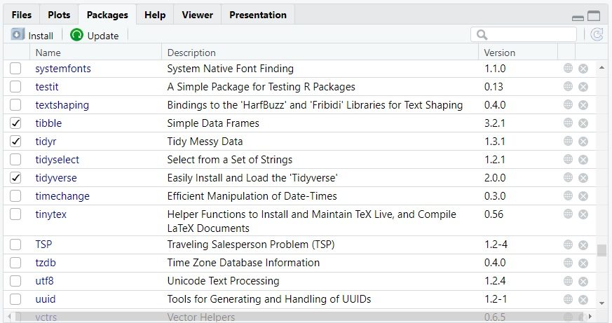
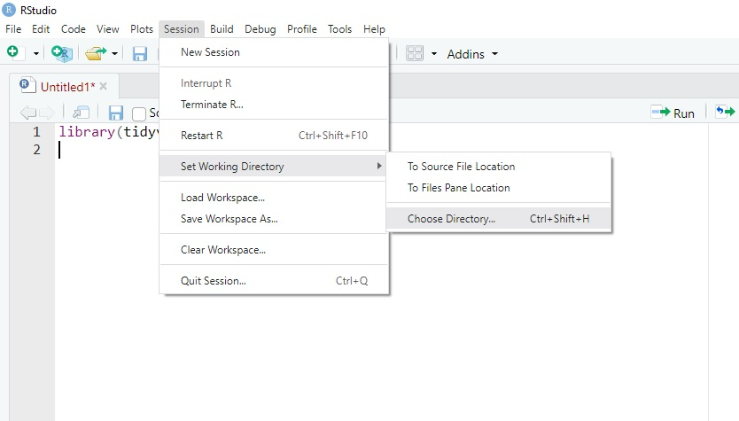

# Packages and Importing Data

In this chapter we will cover two important features of RStudio. Firstly is the use of packages. Packages allow you to access a variety of different functions. Additionally, before you begin working with any data you will need to somehow actually get that data into RStudio via a working directory.

## What are Packages?

When you first open RStudio, you will have access to many base R functions. In fact there are a great deal of functions that exist in the base version of R. In fact, you have already used some in the previous chapter, for example, `date()` or `round()` are considered base R functions.

Base R is essentially the "basic subscription" version of RStudio without any additional apps installed.

Often we might need some quite specialised functions. In order to access these we need to install and load `packages`. You can think of `packages` as a bit like your mobile phone apps...in that you need to download them, install them, and then open them to access their specific functions.

One **key** package that is required for learning and using R for Psychology at Royal Holloway is the `tidyverse` package. `Tidyverse` is essentially a collection of packages, see more [here](https://www.tidyverse.org/).

### Installing a Package

Tidyverse is already installed on most Royal Holloway campus computers and so this step is not necessary. But still worth a read as in future you may need to install other packages beyond the tidyverse.

To install tidyverse we can use the `install.packages()` function. See below:


```r
install.packages("tidyverse") # install the tidyverse package
```

Note you'll see I also followed my own advice and used human notes with the hashtag `#`.

You'll notice that the name of the package needs to be in quotation marks. When you run this line of code, RStudio will get to work installing the package. It might take a couple of minutes and you will see this happening in the console (bottom left panel).

### Loading a Package

Just because you have installed a package does not yet mean you are ready to use it. Next you need to load it. To do this you can use the `library()` function below:


```r
library(tidyverse) # load the tidyverse package
```

Note that we do not need to use quote marks.

Remember, you only need to install a package once on your computer. However, each time you reopen RStudio (whether at home or on a campus PC), you'll need to load the necessary libraries using the `library()` function.

### Checking Packages

You can check which packages you have installed and loaded at anytime. Head to the "packages" tab on the bottom right panel. If the package is listed then it is installed. If there is a tick in the box on the left, that also means the package has been loaded and is ready to go! Why not try and un-tick and then tick tidyverse in this panel and see what happens in the console. See Figure \@ref(fig:fig-environment-3) below.

<div class="figure" style="text-align: center">

<p class="caption">(\#fig:fig-environment-3)An example of the packages tab with the Tidyverse package loaded.</p>
</div>

## Importing Data

Now we have Tidyverse loaded, you can begin thinking about importing some data. There are different way to import data, and you might actually notice an `Import Dataset` in the environment panel. However, the best way to import data is via a `Working Directory` and using a Tidyverse function called `read_csv`. Let's go through this bit by bit.

### Set the Working Directory

The working directory is a folder on your computer that RStudio will look in to find any data files. It is also where RStudio can save any output files too.

Before setting your working directory it is important to think about your file structure on your computer. For example, you might consider creating a special folder to save any of your RStudio work. You can then link this special folder to RStudio using the steps below.

Head to the `Session` tab at the top of the RStudio window and then select `Set Working Directory` -\> `Choose Directory`. See Figure \@ref(fig:fig-environment-4) below.

<div class="figure" style="text-align: center">

<p class="caption">(\#fig:fig-environment-4)Set the working directory</p>
</div>

This will open up a file browser on your computer. Select the folder on your computer that you have designated as your `Working Directory`. The one in Figure \@ref(fig:fig-environment-5) is called `R_Folder` but you might call yours something else if you like, for example, `StartR`. You'll notice that the folder I have selected below is empty because it is a new folder with nothing in it...yet!

<div class="figure" style="text-align: center">

<p class="caption">(\#fig:fig-environment-5)Head into the folder that you will use as your working directory in this session</p>
</div>

In case you forget, you can check your working directory at any point using this line of code:


```r
getwd() # will check the current working directory.
```

You should see in the console (bottom left) that RStudio will tell you the location of the folder on your computer that is now your designated working directory.

### Importing Data

RStudio primarily likes to work with a file format called `.csv`. This stands for comma separated values. There are ways to import other types of files (e.g., SPSS, excel, text) but during this course we will only work with `.csv` files.

Let's try and get a basic data set in to RStudio. Download the data set below and *remember* save it into your designated working directory folder. For reference, the data are also presented below.

[Download the data set](data/height.csv)

| id  | age | height |
|-----|-----|--------|
| 1   | 22  | 167    |
| 2   | 26  | 178    |
| 3   | 18  | 173    |
| 4   | 32  | 169    |
| 5   | 19  | 183    |
| 6   | 39  | 172    |
| 7   | 41  | 159    |
| 8   | 46  | 164    |
| 9   | 32  | 153    |
| 10  | 25  | 159    |

: A table of ten people containing their age (in years) and height (in cm).

### read_csv()

Once the data file is in your working directory folder we can try to import it using `read_csv()`.


```r
data <- read_csv("height.csv") # import the height.csv data set and save it as an object called `data`.
```

This line of code here begins to combine everything we have covered in this StartR short course so far. Take a moment ro work through the explanations below to ensure you understand:

-   `data` is an **object**. I have called it data as it is just a short 4 letter word and is our data set.

-   `<-` is the **assignment operator**. It will assign things to the right side to our object on the left side called `data.`

-   `read_csv()` is a **function** which will read data from a .csv file.

-   `"height.csv"` is an **argument** which tells the function how to behave. In this case it will look for a specific file called height.csv.

-   It will look for this file in the `working directory`.

-   If this works successfully you should see an object called `data` in the **environment** panel (top right), see Figure \@ref(fig:fig-environment-6).

-   Notice that "height.csv" is spelled exactly to match the file name. No capital letters or spaces, which is how it appeared when you downloaded it.

<div class="figure" style="text-align: center">

<p class="caption">(\#fig:fig-environment-6)The environment panel with the newly created `data` object</p>
</div>

You might also notice there is some very basic information visible to the right of the object in the environment. For example, there are `10 obs. of 3 variables`. This tells us there are 10 observations across three different variables.

Finally, if you double click on the object name `data`, it will open the data file in a new tab.

You can also achieve the same result using:


```r
view(data) # will open the data in a new tab
```

A final note on `read_csv()`.

You might learn that there is a similar function called `read.csv` (with a dot `.` not an underscore `_`). Do not use read.csv. Always use the version with an underscore, which comes from the tidyverse package.

### Some (very) Basic Descriptive Statistics

In the final part of this chapter, you will calculate some very basic descriptive statistics. I wanted to minimise any "stats" stuff in this short course as the aim is really to learn about the RStudio layout and how it works before we properly work with data.

However, the code below will allow you to practice a little more understanding R functions, running code, and reading output.

We need a new package for this final section:


```r
install.packages("psych") # install Psych package
library(psych) # load the psych package
```

How about you work out some basic descriptive statistics for this data file. Using the `psych` package, you could use:


```r
describe(data) # produce descriptive statistics
```

Run that now and check the output. The first line you might notice that id (identification number) has a mean of 5.50. This is meaningless and actually we could remove the ID column. How could we do this?

### Using the Pipe Operator

Do you remember right at the start of chapter one I used the example below which is a three step command:


```r
`stand up` and then,
`walk towards the window` and then,
`return to your seat`
```

With our data we actually want to do the following which is also a three step command:


```r
use `data` and then,
`remove id column` and then,
`describe` it.
```

We can use something called a pipe operator `%>%` which essentially means "and then". What will happen next is we will write out a set of instructions, line by line. Take a look at the code below and then run it:


```r
data %>%
  select(-id) %>%
  describe()
```

The three lines do the following:

1.  Take our object `data` ...and then...

2.  Use `select()` to remove id. We do this adding a minus sign `-` before id...and then

3.  `describe()` the results.

Hopefully you can now see in the console the new output with the id column removed.

You will also see that the mean age was 30 years (SD = 9.64) and the mean height was 167.70 centimeters (SD = 9.25).

Congratulations! You have successfully produced some descriptive statistics.

## Chapter Summary

In this chapter you have learnt about what packages can do for us. You might come across several different packages in the future and so you now know how to install packages and then load them. Another important task is being able to set the working directory. This is the folder on your computer that RStudio will use to find any data files. Next, you would have successfully imported a data file using read_csv(). Finally, you should have use code to produce some very simple descriptive statistics.
